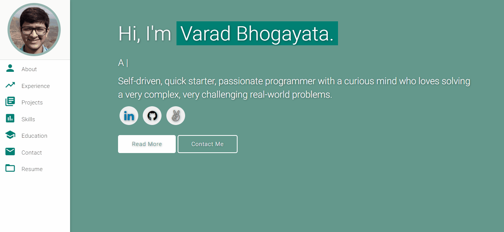

# Personal Portfolio ⚡️ 
> A clean, beautiful, responsive portfolio template for Software Developers!

> https://evanbrown4.github.io

### Website Preview

 
  <kbd>
    
  </kbd>

Template by [Varad Bhogoyata](https://github.com/varadbhogayata)

## License 📄
This project is licensed under the MIT License - see the [LICENSE.md](./LICENSE) file for details.

## Tools Used 🛠️
* [<b>GitHub Pages</b>](https://create-react-app.dev/docs/deployment/#github-pages) - To host my static website (HTML, CSS, JS).
* [<b>Materialize</b>](https://materializecss.com/) - A CSS framework to get Google's Material Design components.
* [<b>Typed.js</b>](https://mattboldt.com/demos/typed-js/) - JavaScript Library
